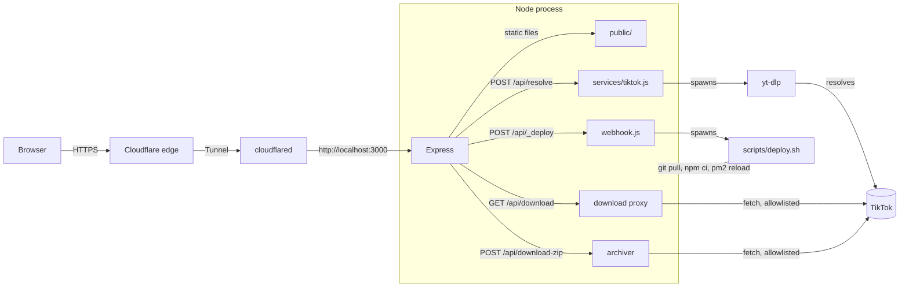

# Architecture

## Overview

SlickTok is a single Node.js process (Express) that serves a static
frontend and a small JSON API. There is no database, no queue, no
build step for the frontend, and no separate reverse proxy — Cloudflare
Tunnel connects directly to the Node process.

## Why yt-dlp instead of a hand-written extractor

TikTok has no public API for this. Every downloader site, including
the one that inspired this project, works by either reverse-engineering
TikTok's private web/app API or by shelling out to something that
already does. `yt-dlp` maintains that extraction logic upstream, with
frequent releases specifically because TikTok changes its internals
often. Writing and maintaining an equivalent extractor from scratch
here would duplicate that work with far less test coverage and no
community maintaining it. `scripts/deploy.sh` runs `yt-dlp -U` on
every deploy, and `DEPLOY.md` sets up a daily cron job to do the same
independent of code deploys, since a `yt-dlp` release can fix TikTok
compatibility with no changes to this repository at all.

## Request flow: resolving a video

1. Client `POST /api/resolve` with `{ url }`.
2. `server/middleware/rateLimiter.js` checks the hourly and daily
   counters for the caller's IP (`CF-Connecting-IP` header when
   present, falling back to `req.ip`).
3. `server/services/tiktok.js` validates the URL's hostname ends in
   `tiktok.com`, then runs `yt-dlp -j <url>` and parses the JSON
   info-dict it returns.
4. Formats are filtered to exclude anything yt-dlp marked
   `format_note: "watermarked"`, deduplicated by resolution, and the
   top one or two are exposed as `sd`/`hd` download URLs.
5. The normalized result (title, author, stats, thumbnail, download
   URLs) is returned to the client — nothing is persisted.

## Request flow: downloading a file

The URLs returned by `/api/resolve` are not exposed to the browser
directly as final download links. Instead, the client requests
`GET /api/download?src=<tiktok-cdn-url>&filename=<name>`, and the
server:

1. Validates that `src`'s hostname matches a fixed allowlist of known
   TikTok CDN domains (`server/services/tiktok.js`,
   `isAllowedCdnUrl`). Anything else is rejected before any outbound
   request is made — this is the SSRF guard mentioned in
   [SECURITY.md](SECURITY.md).
2. Fetches `src` with a browser-like `User-Agent` and a `Referer` of
   `https://www.tiktok.com/`, since TikTok's CDN checks both.
3. Streams the response body straight through to the client with a
   `Content-Disposition: attachment` header. Nothing touches disk.

Photo slideshows use the same allowlist for each image, and
`/api/download-zip` streams them into a zip archive on the fly via
`archiver`, again without buffering the whole thing on disk.

## Auto-deploy

`server/routes/webhook.js` is mounted before the JSON body parser
specifically so it can read the raw request body — GitHub's
`X-Hub-Signature-256` HMAC is computed over the exact bytes sent, and
re-serializing parsed JSON would break the signature check. On a
verified push to the configured branch, it spawns
`scripts/deploy.sh` as a detached process and responds immediately;
the script pulls, reinstalls dependencies, updates `yt-dlp`, and
reloads the PM2 process. See [DEPLOY.md](DEPLOY.md) for the full
setup.

## Known limitations

- **Photo slideshow images aren't extracted.** yt-dlp's TikTok
  extractor currently exposes the audio track for slideshow posts but
  not the individual images. `data.images` is always `null` for now;
  the frontend and API shape already support it so this can be filled
  in later without a breaking change.
- **yt-dlp's info-dict shape is a moving target.** The field mapping
  in `server/services/tiktok.js` was written against yt-dlp
  `2026.07.04`. If TikTok changes its API, a newer yt-dlp release
  will usually keep working without any changes here — but if
  downloads start failing, run `yt-dlp -j <url>` directly on the
  server to see the current shape before assuming this repo's code is
  the problem.
- **Single process, in-memory rate limiting.** Fine for one server.
  If you ever run multiple instances behind a load balancer, the
  rate limiter would need a shared store (e.g., Redis via
  `rate-limit-redis`) instead of `express-rate-limit`'s default
  in-memory store.
- **No audio extraction for ordinary videos.** Only slideshow posts
  expose a separate audio-only stream from yt-dlp; a regular video's
  audio is muxed into the video file. Offering a standalone MP3 for
  ordinary videos would require running `ffmpeg` server-side to
  extract it — not implemented here to keep the server's job simple
  (download and proxy, not transcode).
