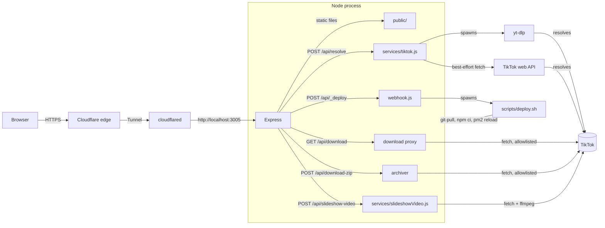

# Architecture

## Overview

SlickTok is a single Node.js process (Express) that serves a static
frontend and a small JSON API. There is no database, no queue, no
build step for the frontend, and no separate reverse proxy, Cloudflare
Tunnel connects directly to the Node process.

## Why yt-dlp instead of a hand-written extractor

TikTok has no public API for this. Every downloader site, including
the one that inspired this project, works by either reverse-engineering
TikTok's private web/app API or by shelling out to something that
already does. `yt-dlp` maintains that extraction logic upstream, with
frequent releases specifically because TikTok changes its internals
often. Writing and maintaining an equivalent extractor from scratch
here would duplicate that work with far less test coverage and no
community maintaining it. `scripts/deploy.sh` runs `yt-dlp -U` on
every deploy, and `DEPLOY.md` sets up a daily cron job to do the same
independent of code deploys, since a `yt-dlp` release can fix TikTok
compatibility with no changes to this repository at all.

## Request flow: resolving a video

1. Client `POST /api/resolve` with `{ url }`.
2. `server/middleware/rateLimiter.js` checks the hourly and daily
   counters for the caller's IP (`CF-Connecting-IP` header when
   present, falling back to `req.ip`).
3. `server/services/tiktok.js` validates the URL's hostname ends in
   `tiktok.com`, then runs `yt-dlp -j <url>` and parses the JSON
   info-dict it returns. This is the reliable path and covers both
   full `tiktok.com/@user/video/ID` links and short `vm.tiktok.com`
   / `vt.tiktok.com` redirect links, yt-dlp resolves the redirect
   itself.
4. Formats are filtered to exclude anything yt-dlp marked
   `format_note: "watermarked"`, deduplicated by resolution, and the
   top one or two are exposed as `sd`/`hd` download URLs.
5. Separately, `fetchWebEnrichment()` makes a **best-effort** call to
   TikTok's undocumented `item_detail` web endpoint to try to get the
   author's avatar image and, for photo posts, the individual image
   URLs, neither of which `yt-dlp` exposes. If this call fails for any
   reason (blocked, rate-limited, schema changed), the function
   returns `null` and the rest of the response is unaffected, the
   avatar falls back to an initial letter, and a slideshow's images
   stay empty with an explanatory `warning`. This call is genuinely
   fragile since it depends on an unofficial endpoint; treat it as a
   bonus, not a guarantee.
6. The normalized result (title, author, stats, thumbnail, download
   URLs, images) is returned to the client, nothing is persisted.

## Request flow: downloading a file

This has gone through two designs before landing here, worth knowing
if you're debugging a download issue:

- **v1**: fetch the raw signed CDN URL directly with a hand-picked
  `User-Agent`/`Referer`. Fast, but unreliable, TikTok's CDN is
  choosier than its metadata API about what it'll serve to a bare
  `fetch()`, and the signed URLs are short-lived, so a download
  minutes after resolving could 502 even with correct headers.
- **v2**: run `yt-dlp <url> -f <format_id> -o -` and pipe its stdout
  straight into the HTTP response. Fixed the reliability problem, but
  introduced two new ones: no `Content-Length`/`Accept-Ranges` (so the
  preview player couldn't seek, and a stalled connection partway
  through a large file just looked like "corrupt"), and the rarer
  audio-merge fallback (below) turned out to be genuinely fragile when
  yt-dlp/ffmpeg have to mux two streams into a live, non-seekable pipe
  rather than a real file.
- **Current**: download to a real temp file, then serve *that* with
  Express's `res.sendFile()`, which handles `Range`, `Accept-Ranges`,
  conditional requests, and `Content-Length` correctly out of the box.
  Slower to start (the full file has to land on disk before the
  response can begin), but both v2 problems go away: the preview
  player can seek properly, and the merge fallback gets a normal
  seekable output target. This trade was made deliberately, slower but
  correct beat fast but occasionally broken.

1. The client requests `GET /api/download?url=<original-tiktok-url>&quality=sd|hd|audio&filename=<name>`,
   passing the *source* TikTok page URL, not a CDN URL.
2. The server validates `url` is a supported TikTok link and `quality`
   is one of `sd`/`hd`/`audio`, then calls `getFormatIdForQuality()`
   in `server/services/tiktok.js`, which runs `yt-dlp -j` fresh (see
   the caching note below) and applies the same no-watermark/height
   ranking logic used at resolve time to pick a `format_id`.
3. `downloadMediaToFile()` spawns
   `yt-dlp <url> -f <format_id> -o <tmpfile> --merge-output-format mp4`
   and waits for it to finish, writing to a fresh temp directory
   (`fs.mkdtemp`).
4. The route serves that file with `res.sendFile()` and cleans up the
   temp directory in the callback, once the response is done, whether
   it succeeded or failed partway. By default this sends
   `Content-Disposition: attachment` to force a download; passing
   `?inline=1` (used by the in-page video preview) sends `inline`
   instead, and since the file is now fully seekable, the `<video>`
   element can scrub through it normally.

**Picking a format that actually has audio.** TikTok sometimes
exposes a higher-resolution video-only stream alongside the normal
combined (video+audio) file. Ranking purely by height, as an earlier
version of this code did, can pick that video-only stream, which
downloads and plays back fine visually but with no sound.
`classifyFormats()` now prefers formats that already carry audio
(`acodec !== 'none'`) and only falls back to a video-only pick, merged
with the best available audio track via `-f "<id>+bestaudio"` (yt-dlp
+ ffmpeg handle the actual muxing), when no combined format exists at
all. `--merge-output-format mp4` keeps the output container consistent
either way. This fallback is a real edge case (higher-quality videos
are the most likely to hit it, since that's where a video-only-only
stream is most likely to exist), and now that it downloads to a real
file instead of a live pipe, the merge itself has a normal seekable
target to write to.

**Avoiding a redundant re-resolve.** Re-resolving at download time
(above) costs a few seconds, dominated by `yt-dlp`'s own startup and
its extraction round-trip to TikTok, before the download-to-file step
even begins. Since the common case is clicking download moments
after resolving, `server/services/tiktok.js` keeps a short-lived
(3 minute) in-memory cache of each URL's classified formats, populated
at resolve time and consulted before `getFormatIdForQuality()` would
otherwise re-run `yt-dlp -j` from scratch. This cuts out one of the
two `yt-dlp` invocations in the common case; the second (the actual
download-to-file step) is unavoidable in this architecture. A cache
miss (first download, or one that lands after the window closes) just
falls back to a fresh call, no functional difference, only slower.

The slideshow-to-video converter (below) uses the same
`getFormatIdForQuality()` path to fetch its audio track, for the same
reason. Photo slideshow *images* still go through a plain `fetch()`
with the allowlist, since they come from the separate web-enrichment
call and yt-dlp has no format entry for them at all.
`/api/download-zip` streams them into a zip archive on the fly via
`archiver`, and `/api/slideshow-video` (see below) downloads them to a
temp directory for `ffmpeg` to process, neither buffers the whole set
in memory at once.

## Slideshow-to-video conversion

`server/services/slideshowVideo.js` turns a photo slideshow into an
MP4, timed to its background audio:

1. Downloads every image and the audio track into a fresh temp
   directory (`fs.mkdtemp`).
2. Runs `ffprobe` on the audio to get its duration, then divides that
   evenly across the images to get a per-image display time.
3. Builds an `ffmpeg concat` demuxer script (hard cuts between
   images, no crossfade, simple and predictable) and runs a single
   `ffmpeg` pass that scales/pads everything to a 1080x1920 portrait
   canvas, encodes H.264 + AAC, and muxes in the audio.
4. Streams the resulting file back and deletes the temp directory
   once the response finishes.

This only works when both images and an audio track were available
from the resolve step, so it inherits the same best-effort limitation
as image extraction above. It's also rate-limited separately
(`conversionLimiter` in `server/middleware/rateLimiter.js`) since
it's meaningfully more CPU-intensive than a plain download.

## Auto-deploy

`server/routes/webhook.js` is mounted before the JSON body parser
specifically so it can read the raw request body, GitHub's
`X-Hub-Signature-256` HMAC is computed over the exact bytes sent, and
re-serializing parsed JSON would break the signature check. On a
verified push to the configured branch, it spawns
`scripts/deploy.sh` as a detached process and responds immediately;
the script pulls, reinstalls dependencies, updates `yt-dlp`, and
reloads the PM2 process. See [DEPLOY.md](DEPLOY.md) for the full
setup.

## Known limitations

- **Avatar and slideshow images are best-effort.** Both depend on an
  undocumented TikTok web endpoint that isn't guaranteed to keep
  working (see step 5 above). When it fails, the UI degrades
  gracefully rather than breaking.
- **yt-dlp's info-dict shape is a moving target.** The field mapping
  in `server/services/tiktok.js` was written against yt-dlp
  `2026.07.04`. If TikTok changes its API, a newer yt-dlp release
  will usually keep working without any changes here, but if
  downloads start failing, run `yt-dlp -j <url>` directly on the
  server to see the current shape before assuming this repo's code is
  the problem.
- **Single process, in-memory rate limiting.** Fine for one server.
  If you ever run multiple instances behind a load balancer, the
  rate limiter would need a shared store (e.g., Redis via
  `rate-limit-redis`) instead of `express-rate-limit`'s default
  in-memory store.
- **No audio extraction for ordinary videos.** Only slideshow posts
  expose a separate audio-only stream from yt-dlp; a regular video's
  audio is muxed into the video file. A standalone MP3 for ordinary
  videos would need `ffmpeg` to extract it server-side, not
  implemented for plain videos (only for the slideshow converter
  above, which already shells out to `ffmpeg` for a different
  reason).
- **Downloads write a temp file to disk before serving it.** See
  "Request flow: downloading a file" above for why, slower to start
  than piping, but fixes real correctness problems. Means disk I/O
  and temporary space proportional to the video size; fine for
  TikTok-length clips on typical server disks, worth knowing if you
  ever see disk pressure under heavy concurrent use.
- **Slideshow-to-video is hard cuts only.** No crossfade or
  Ken-Burns-style pan/zoom between images. Doable later with a more
  elaborate `ffmpeg` filter graph, kept simple for now.
